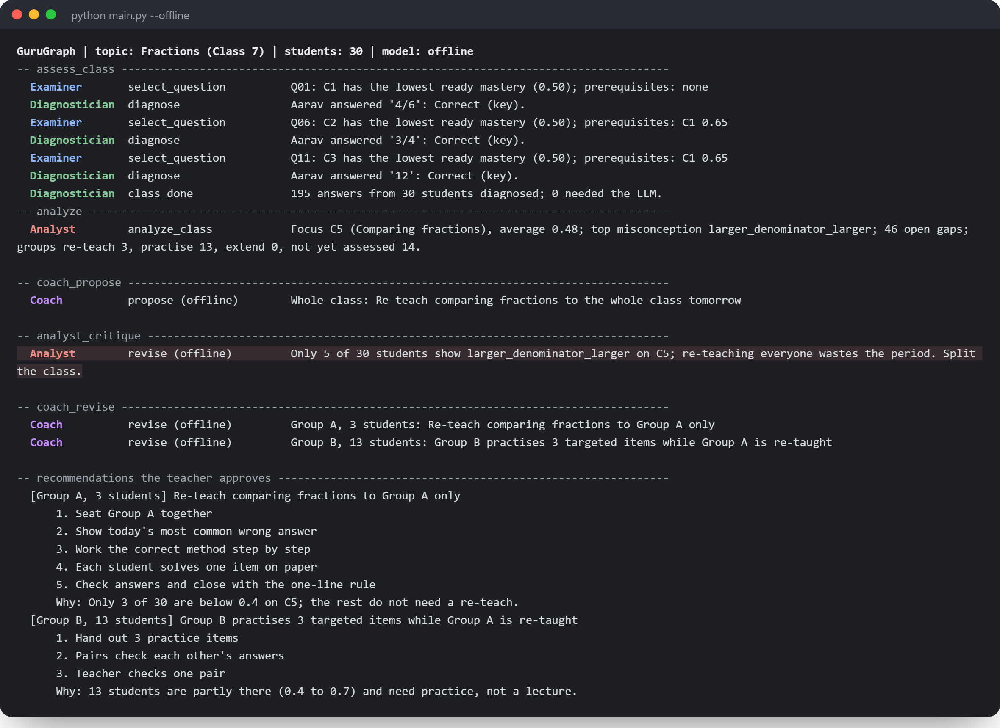

# Multi-Agent Teaching & Learning Ecosystem

> Five LangGraph agents share one Knowledge-Gap Graph to find each student's misconceptions, write a micro-lesson in their language, and hand the teacher a 5-minute plan for tomorrow's class.

A classroom of 40 to 60 students usually discovers its misconceptions at exam time. This example shows how a small team of agents can find them within one quiz. A **Diagnostician** names the exact misconception behind a wrong answer, including from a photo of handwritten working. An **Examiner** adapts the next question to the student's gaps. A **Curator** writes a short lesson in English, Hindi or Kannada. An **Analyst** turns the class into numbers and groups. A **Coach** proposes what the teacher should do. The Analyst then **challenges the Coach with the data**, and the Coach revises before anything reaches the teacher.

Built with LangGraph and Gemini. It runs fully offline with a deterministic stand-in model, so you can read the whole workflow and run the tests without an API key.

## 🚀 Features

- **Rules first, LLM for the long tail**: multiple-choice answers are diagnosed from misconception-tagged distractors and typed answers with exact fraction arithmetic. Only unfamiliar answers and photos go to the LLM, so a simulated class of 30 needs zero LLM calls.
- **Photo diagnosis**: send a picture of handwritten working and get back the transcribed steps, the first wrong step and the misconception (Gemini vision with a JSON schema).
- **Agents that argue**: the Analyst's critique is backed by explicit rules, so every challenge cites real numbers and the LLM can rephrase a verdict but never flip it.
- **Multilingual micro-lessons**: English, Hindi and Kannada, with a script check and a retry when the model drifts into English.
- **Verified gap closure**: retry items that decide whether a gap closed always come from the checked question bank, never from generated text.
- **Explainable**: every hand-off is logged with a one-line reason and streamed from the LangGraph run.
- **Evaluation included**: `--eval` scores the Diagnostician on 50 hand-labelled typed answers; `--eval-photos` scores photo diagnosis on your own labelled pictures.

## 🛠️ Tech Stack

- **Python 3.10+**
- **[LangGraph](https://github.com/langchain-ai/langgraph)**: orchestration, conditional routing and streaming of the agent workflow
- **[Google Gemini](https://ai.google.dev/)** (`google-genai`): text and vision with structured JSON output
- **Any OpenAI-compatible endpoint** (for example Nebius Token Factory or Groq) as a text-only alternative
- **Pydantic**: schemas shared by the LLM calls and the validators
- **JSON topic pack**: 8 fraction concepts with prerequisites, 40 questions, 13 misconception tags

## Workflow

```
assess_class -> analyze -> coach_propose -> analyst_critique --revise--> coach_revise -> curate -> END
                                                            \--accept---------------> curate
```

1. **assess_class**: for each student the Examiner picks the lowest-mastery concept whose prerequisites are ready, and the Diagnostician diagnoses the answer. Mastery and open gaps update the shared graph.
2. **analyze**: the Analyst finds the concept with the most open gaps, its top misconceptions (slips are counted separately) and three learner groups.
3. **coach_propose**: the Coach drafts at most two teacher recommendations with a 5-minute plan.
4. **analyst_critique**: rule checks test each draft against the data (for example, a whole-class re-teach when fewer than half the class shows the misconception). A challenged draft routes to **coach_revise**.
5. **curate**: the Curator writes cached micro-lessons for the students with the largest gaps, picks two verified retry items, and the Coach drafts a message for each family.

## 📦 Getting Started

### Prerequisites

- Python 3.10+
- [uv](https://github.com/astral-sh/uv) or pip
- Optional: a [Google AI Studio](https://aistudio.google.com/apikey) API key for real diagnoses, lessons and photo reading

### Environment Variables

Copy `.env.example` to `.env`. Everything is optional; with no key the example runs offline.

```env
GEMINI_API_KEY="your_gemini_api_key"
GEMINI_MODEL="gemini-2.5-flash"

# Optional text-only alternative (OpenAI-compatible, e.g. Nebius Token Factory or Groq)
OPENAI_COMPAT_BASE_URL="https://your-provider/v1"
OPENAI_COMPAT_API_KEY="your_key"
OPENAI_COMPAT_MODEL="meta-llama/Llama-3.3-70B-Instruct"
```

### Installation

1. **Clone the repository:**

   ```bash
   git clone https://github.com/Arindam200/awesome-ai-apps.git
   cd awesome-ai-apps/advance_ai_agents/multi_agent_teaching_ecosystem
   ```

2. **Create and activate a virtual environment:**

   ```bash
   python -m venv .venv
   source .venv/bin/activate  # On Windows: .venv\Scripts\activate
   ```

3. **Install dependencies:**

   ```bash
   uv sync            # or: pip install -r requirements.txt
   ```

## ⚙️ Usage

```bash
python main.py --offline                        # no key needed: watch the five agents work on a class of 30
python main.py --language kn                    # real LLM, lessons in Kannada
python main.py --photo my_working.jpg --question Q22   # diagnose a photo of handwritten working
python main.py --eval                           # score the Diagnostician on 50 labelled typed answers
python main.py --eval-photos data/eval_photo    # score photo diagnosis on your labelled photos
pytest                                          # 18 offline tests
```

A shortened offline run:

```
-- analyze
  Analyst        analyze_class       Focus C5 (Comparing fractions), average 0.48; top misconception larger_denominator_larger; ...
-- coach_propose
  Coach          propose (offline)   Whole class: Re-teach comparing fractions to the whole class tomorrow
-- analyst_critique
  Analyst        revise (offline)    Only 5 of 30 students show larger_denominator_larger on C5; re-teaching everyone wastes the period. Split the class.
-- coach_revise
  Coach          revise (offline)    Group A, 3 students: Re-teach comparing fractions to Group A only
```

To use your own topic, replace `data/fractions.json` with a pack in the same format: concepts with prerequisites, a misconception taxonomy, and questions whose wrong options carry a tag.

## 📂 Project Structure

```
multi_agent_teaching_ecosystem/
├── assets/                  # demo image
├── data/
│   ├── fractions.json       # topic pack: concepts, prerequisites, taxonomy, 40 questions
│   ├── personas.json        # 30 synthetic students for the simulated class
│   ├── eval_text.jsonl      # 50 hand-labelled typed answers
│   └── eval_photo/          # how to build a labelled photo set
├── teaching_ecosystem/
│   ├── agents/              # diagnostician, examiner, curator, analyst, coach
│   ├── llm.py               # Gemini, OpenAI-compatible and offline providers
│   ├── prompts.py           # every system prompt in one place
│   ├── schemas.py           # structured outputs
│   ├── state.py             # the Knowledge-Gap Graph and its update rules
│   ├── topic.py             # topic pack loading and answer parsing
│   └── workflow.py          # the LangGraph graph
├── tests/                   # offline tests
├── main.py                  # command-line entry point
├── pyproject.toml
├── requirements.txt
└── .env.example
```

## 🤝 Contributing

Contributions are welcome. Please read the repository's [CONTRIBUTING.md](https://github.com/Arindam200/awesome-ai-apps/blob/main/CONTRIBUTING.md).

## 📄 License

This project is licensed under the MIT License. See the repository [LICENSE](https://github.com/Arindam200/awesome-ai-apps/blob/main/LICENSE).

## 🙏 Acknowledgments

- [LangGraph](https://github.com/langchain-ai/langgraph) for the workflow runtime.
- The misconception taxonomy draws on common fraction errors reported in mathematics education research and in classroom practice in Indian schools.
